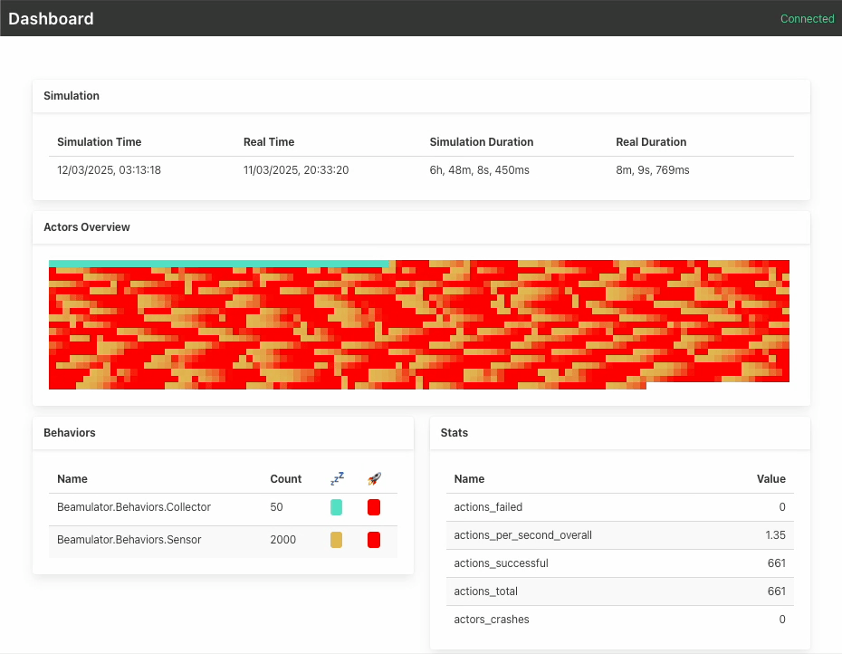
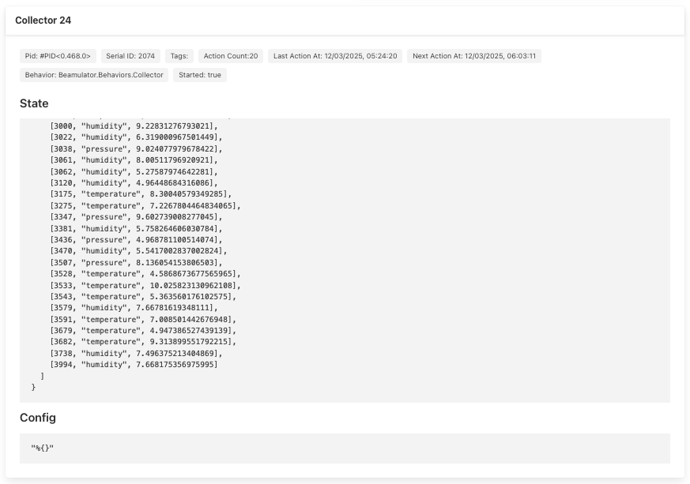

# Beamulator

A playful, experimental agent-based population simulator built with Elixir.

## What Is It?

Beamulator is a fun project I tinker with on weeknights as I take my first steps in Elixir — and my ~~serious~~ response to the good old “test in production!” adage 🤪.

It simulates a lively population of independent actors, each running in its own process. Every actor acts based on a user-defined behavior. Key highlights include:

- **Agent-Based Simulation:** Behaviors are defined as stateless `act` functions, allowing on-the-fly replacements and manual tweaks.
- **Testing in Production (Sort Of):** Create a dynamic, production-like environment where you can experiment with live features and explore novel testing methods without taking things too seriously.
- **Time Scaling:** Run the simulation faster than real time, so you can iterate and test time-dependent features without the wait.
- **Fuzzy Testing:** Actor choices can be fuzzed, opening the door to entirely new testing patterns.
- **Work in Progress:** This project is a moving target. Whether it evolves into a library, framework, or standalone app is anyone’s guess.

## 🚨 DISCLAIMER 🚨

>This not a project (yet?), it's just me tinkering and having fun. It can't even be called a work in progress. It's only public because I think it's fun and I'm happy to share the idea. Do not expect it to run ~~flawlessly~~ or to be documented in any way beyond this very synthetic readme and a couple of very likely outdated examples!

## Structure

A simulation scenario is defined by a few user defined modules:

- `Beamulator.Actions` (`actions.ex`)
- `Beamulator.ActorsConfig` (`actors_config.ex`)
- `Beamulator.Behaviors.<Behavior Name>` (at least one)

### Beamulator.Actions

This is the interface with the target service. It should be defined in terms of user actions, like "user_register", "empty_cart", and so on, but you do you.

### Beamulator.ActorsConfig

This defines how many actors will be spawned for each defined behavior, along with some additional data.

### Beamulator.Behaviors.*

One module per behavior. These will be referenced by module name in the application, and they should implement the Beamulator.Behavior (module name) behaviour (elixir keyword).

## What can actors/behaviors do?

The simplest way is to think of an actor with a behavior as an NPC in a video game. Just define how you want it to act based on its state.

With this in mind, a behavior must define an `act` function that defines how it should act, and perform actions through the `execute()` function. Here's a simple example of a simulated sensor that will send a steady stream of data to a backend, occasionally sending an outlier:

```elixir
defmodule Beamulator.Behaviors.Sensor do
  alias Beamulator.Lab.Duration, as: D
  use Beamulator.Behavior
  require Logger

  @decision_wait_ms D.new(m: 10)

  @impl true
  def default_tags(), do: MapSet.new()

  @impl true
  def default_state(), do: %{}

  @impl true
  def act(%{simulation_data: simulation, actor_state: state} = actor_data) do
    if :rand.uniform() <= 0.02 do
      execute(actor_data, &Actions.send_metric/1, 1000)
    else 
      execute(actor_data, &Actions.send_metric/1, 1)
    end

    wait(actor_data)
  end

  defp wait(actor_data) do
    to_wait = @decision_wait_ms

    {:ok, to_wait, actor_data}
  end
end
```

That's basically it. Since this is just an elixir function, you're free to do whatever with it.

### Complaints

What's the point of testing in production if users don't complain?\*

You can define expectations for the result of actions, and the actors will complain (in the form of a complaint log in Beamulator's database) if it isn't matched. For example, a behavior updating a task in a todo application might complain if the result of its action doesn't get displayed (in case you didn't know, this is a very common consistency level called "read your writes"!):

```elixir
execute(
  data,
  &Actions.update_task/1,
  %{
    id: task["id"],
    title: task["title"],
    completed: true
  },
  build_complaint(
    fn {status, result} -> status == :ok and not result["completed"] end,
    "I marked a task complete but it's still marked incomplete 🤬",
    :annoying
  )
)
```

\* as it turns out, it can be very useful regardless, but... _There's a time and place for everything but not now!_

## Action Log and QuestDB

Beamulator uses [QuestDB](https://questdb.io) to store an action log and a complaint log. This log can be analyzed to offer a historical view of the simulation’s activity. I'm always looking for an excuse to use QuestDB: it's packed with features and crazy fast, all with minimal operational complexity. What's not to love?

Not affiliated, just a fan!

## User Interface

A simple UI lets you monitor the simulation in real time. The dashboard offers insights into actor activities and overall system status, making it easy to see what’s happening under the hood.




## Performance

No efforts have been made to optimize performance - this is about experimenting with the language, exploring new concepts, and having fun.

## Getting Started

**Note:** Again, this project isn’t meant for widespread sharing! But if you really want to try it out, here's a general idea on how to do it.

To get Beamulator up and running on your local machine, follow these steps:

```sh
git clone https://github.com/impproductions/beamulator.git
cd beamulator
mix deps.get
```

The project has several `example-<something>` directories. Pick your favourite and set it as the simulation path in the `mix.exs` file:

```elixir
[...]
  defp simulation_path(), do: "example-todo/simulation"
[...]
```

Whatever example you pick will (should 🙄) also have instructions on how to run its backend.

Please note that the `example-sandbox` is just that: a sandbox. You should ignore it, as it could contain basically anything.

Once you're done, start QuestDB running the following in the repo's root directory:

```sh
docker compose up -d
```

And finally, you can start the simulator with:

```sh
iex -S mix
```

## Roadmap

See `ROADMAP.md`

## License

This project is licensed under the Apache License 2.0 — see the [LICENSE](LICENSE) file for details.
